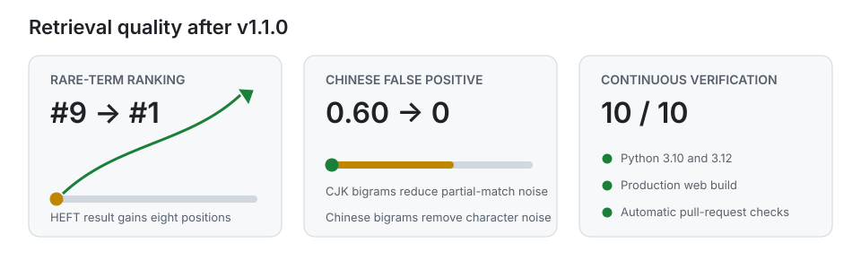

# Atlas Agent Platform

Atlas is an English-first, self-hosted AI agent workspace for U.S. teams and developers. It combines agent creation, knowledge-base retrieval, OpenAI-compatible models, GitHub tools, and human-approved actions in one React and FastAPI application.

Current version: **v1.2.0** · [Changelog](CHANGELOG.md) · [Release process](docs/RELEASING.md)

## Why Atlas

- **OpenAI-ready defaults:** start with `gpt-4.1-mini` and `text-embedding-3-small`, or point Atlas at another OpenAI-compatible endpoint.
- **Built around U.S. developer workflows:** an English UI, GitHub integration, macOS/Linux and Windows launchers, and examples for support, sales, knowledge management, and engineering.
- **Self-hosted and inspectable:** conversations, documents, agent drafts, and connector settings remain in infrastructure you control.
- **Human approval for write actions:** agents can research freely while actions such as sending a message or changing GitHub state require confirmation.
- **Resilient retrieval:** semantic search automatically falls back to dependency-free BM25 when an embedding service is unavailable or an index is incompatible.

## Features

### Agent Workspace

- Persistent multi-turn sessions with automatic saving and recovery.
- Server-sent event streaming with citations to relevant knowledge-base sources.
- Per-session selection of agents, knowledge bases, models, and connectors.
- A conversational Agent Builder that turns an English request into a runnable manifest, Python entry point, skill spec, and evaluation suite.

### Knowledge Base and RAG

- Parse and chunk PDF, DOCX, TXT, Markdown, CSV, and JSON files.
- Generate embeddings with OpenAI or another OpenAI-compatible provider.
- Use BM25 ranking for reliable English keyword retrieval when embeddings are unavailable or incompatible.
- Show source cards with the document name, page number, excerpt, and relevance score.



### Models, Connectors, and Tools

- Use OpenAI as the primary provider and add compatible endpoints through environment settings.
- Connect to GitHub through its official remote MCP server for repository search, files, issues, and pull requests.
- Require explicit confirmation before connector tools perform write actions.

## Quick Start

### Prerequisites

- Node.js 20.19 or later
- Python 3.10 or later
- An OpenAI API key for model responses and semantic embeddings (optional; local fallback behavior works without one)

### 1. Configure the API

```bash
cp api/.env.example api/.env
```

Add your key to `api/.env`:

```dotenv
OPENAI_API_KEY=your_key_here
```

### 2. Start Atlas

On macOS or Linux:

```bash
./start-dev.sh
```

On Windows PowerShell:

```powershell
./start-dev.ps1
```

The launchers create a Python virtual environment, install missing dependencies, and start both services:

- Atlas workspace: <http://localhost:5173>
- FastAPI documentation: <http://localhost:8000/docs>

Local development uses `api/data/atlas.db`, so PostgreSQL and Redis are not required. A Docker Compose configuration is included for teams preparing a production-style environment.

## Configuration

The most common settings in `api/.env` are:

| Setting | Default | Purpose |
| --- | --- | --- |
| `OPENAI_API_KEY` | empty | Enables model responses and default embeddings |
| `OPENAI_BASE_URL` | `https://api.openai.com/v1` | OpenAI or OpenAI-compatible API endpoint |
| `OPENAI_MODEL` | `gpt-4.1-mini` | Default chat model |
| `EMBEDDING_MODEL` | `text-embedding-3-small` | Optional explicit embedding model |
| `GITHUB_PAT` | empty | Enables the GitHub MCP connector |

`EMBEDDING_API_KEY` and `EMBEDDING_BASE_URL` can target a separate OpenAI-compatible embedding service.

## Verification

Run the API regression suite:

```bash
cd api
python -m unittest discover -s tests -v
```

Build the web application:

```bash
cd web
npm ci
npm run build
```

The same checks run for every pull request and every push to `main`.

## Technology Stack

- React 19 and TypeScript
- FastAPI and SQLAlchemy
- OpenAI-compatible chat and embedding APIs
- Model Context Protocol (MCP)
- SQLite for local development; PostgreSQL configuration included

## Project Status

Atlas is under active development. The roadmap prioritizes measurable retrieval quality, secure tool execution, evaluation coverage, and a low-friction developer experience. Contributions, reproducible bug reports, and focused pull requests are welcome.
